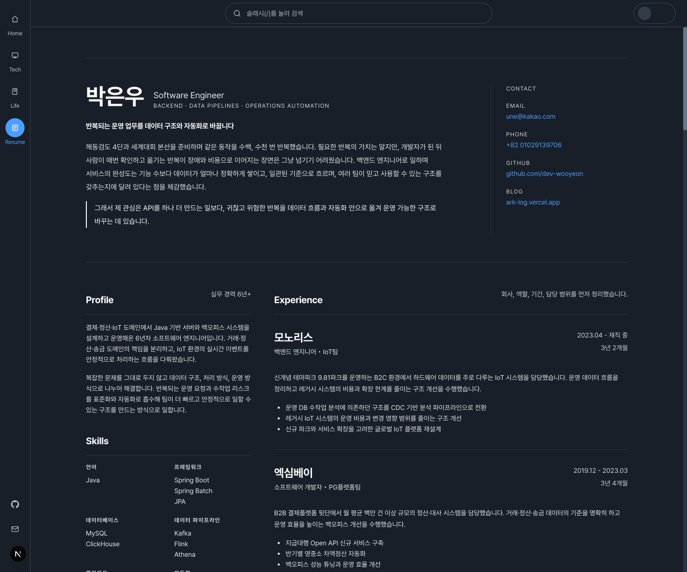
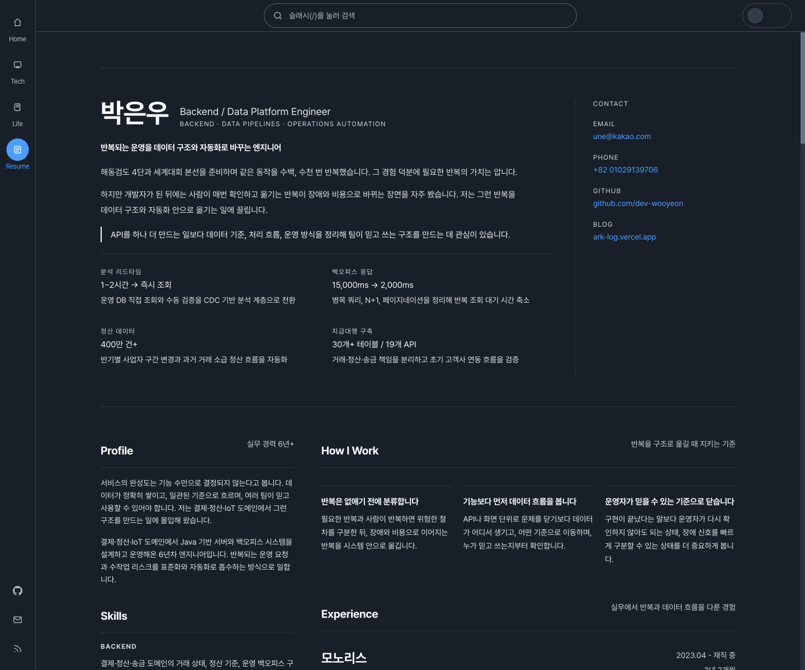
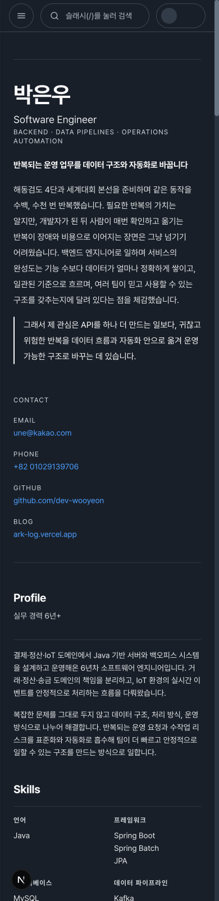
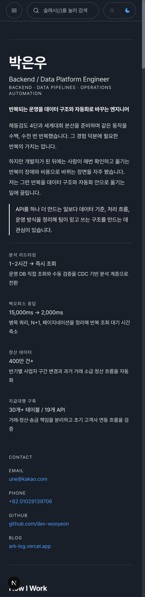

# Resume Profile AS-IS / TO-BE 비교 리포트

작성일: 2026-05-22  
대상 화면: `/resume`

## 비교 기준

| 구분 | 기준 |
| --- | --- |
| AS-IS | `origin/master` (`9d11c153`) |
| TO-BE | `codex/resume-brand-profile` (`7a490ff7`) |
| 데스크톱 캡처 | 1440 x 1200 |
| 모바일 캡처 | 390 x 1600 |

이번 비교는 지원용 이력서가 아니라 공개 프로필, 즉 박은우라는 엔지니어를
설명하고 어필하는 수단으로서의 품질을 기준으로 봤다.

## 요약

TO-BE는 AS-IS보다 개인 브랜딩 메시지가 선명하다. AS-IS는 경력 정보와
프로젝트가 충분하지만 첫 화면에서 "어떤 사람인가"보다 "무엇을 해왔는가"가
먼저 읽힌다. TO-BE는 반복을 구조로 옮기는 사람이라는 메시지, 대표 성과
숫자, 일하는 기준을 앞에 배치해 공개 프로필의 목적에 더 잘 맞는다.

핵심 개선은 세 가지다.

- 상단 메시지가 `Software Engineer`에서 `Backend / Data Platform Engineer`로
  좁혀졌다.
- 첫 화면에 대표 성과 4개가 추가되어 기술 신뢰도와 기억 지점이 생겼다.
- 본문에서 `How I Work`, `Selected Work`, `Technical Experiments`가 추가되어
  경험 나열보다 문제 해석 방식이 먼저 보인다.

## 데스크톱 비교

| AS-IS | TO-BE |
| --- | --- |
|  |  |

### 데스크톱 분석

AS-IS는 첫 화면에서 이름, 직무, 검도 기반 서사, 연락처가 안정적으로 보인다.
다만 첫 화면 하단에 바로 `Profile`, `Skills`, `Experience`가 이어지면서
일반적인 CV 구조처럼 읽힌다. 개인의 관점보다 경력 정보의 정돈감이 먼저 온다.

TO-BE는 같은 서사를 유지하면서도 첫 화면 안에 대표 성과가 추가된다. 이로
인해 "반복을 구조로 옮긴다"는 선언이 추상적인 자기소개에 머물지 않고,
분석 리드타임, 백오피스 응답, 정산 데이터, 지급대행 구축 범위로 이어진다.

데스크톱에서는 좌측 사이드 정보와 우측 핵심 본문이 나란히 보인다. TO-BE의
우측 상단 `How I Work`는 공개 프로필의 성격을 강화한다. 단순히 사용 기술을
나열하는 문서가 아니라, 어떤 기준으로 문제를 보는지 설명하는 문서로 읽힌다.

## 모바일 비교

| AS-IS | TO-BE |
| --- | --- |
|  |  |

### 모바일 분석

AS-IS 모바일은 긴 자기소개 이후 `Contact`, `Profile`, `Skills`가 먼저 나온다.
핵심 경력과 프로젝트까지 도달하기 전에 메타 정보와 기술 목록을 길게 읽어야
한다. 지원용 이력서라면 무난하지만, 공개 프로필로서는 초반 설득력이 분산된다.

TO-BE 모바일은 상단에서 대표 성과 4개를 먼저 보여준다. 긴 프로젝트 상세로
내려가기 전에 독자가 기억할 수 있는 증거가 생긴다. 이후 `Contact`가 나오고,
본문에서는 `How I Work -> Experience -> Selected Work -> Technical
Experiments` 순서로 시각적으로 읽힌다.

캡처 기준에서 TO-BE의 주요 섹션 위치는 다음과 같았다.

| 섹션 | 모바일 상단 위치 |
| --- | ---: |
| `How I Work` | 1,562px |
| `Experience` | 2,130px |
| `Selected Work` | 3,111px |
| `Technical Experiments` | 8,475px |
| `Profile` | 10,788px |

즉, 모바일 시각 흐름에서는 프로필/스킬/활동 같은 보조 정보보다 일하는 방식과
실무 증거가 먼저 노출된다.

## 정보 구조 변화

| 항목 | AS-IS | TO-BE | 효과 |
| --- | --- | --- | --- |
| 직무 정의 | `Software Engineer` | `Backend / Data Platform Engineer` | 전문성이 더 좁고 분명하게 읽힘 |
| 상단 메시지 | 반복 운영 업무를 자동화로 바꿈 | 반복 운영을 데이터 구조와 자동화로 바꾸는 엔지니어 | 행위보다 정체성이 먼저 보임 |
| 상단 증거 | 없음 | 대표 성과 4개 | 선언과 실적이 같은 화면에서 연결됨 |
| 스킬 | 언어/프레임워크/DB/클라우드 나열 | Backend/Data Platform/Cloud & Automation | 기술을 사용 맥락과 연결함 |
| 활동 | `Activities`에 일괄 배치 | `Writing & Mentoring`, `Background`로 분리 | 글쓰기/멘토링이 정체성의 일부로 승격됨 |
| 프로젝트 섹션 | `Projects` | `Selected Work` | 경험 나열보다 선별된 작업으로 읽힘 |
| 개인 프로젝트 | `Personal Projects` | `Technical Experiments` | 토이 프로젝트보다 설계 검증으로 읽힘 |

## 품질 판단

TO-BE는 공개 프로필 목적에 더 적합하다. 특히 다음 지점이 강하다.

- 검도 서사를 제거하지 않고, 필요한 반복과 위험한 반복의 대비로 재해석했다.
- 숫자 성과를 상단에 둬 기술적 신뢰도를 빠르게 확보한다.
- `How I Work`가 추가되어 경험 목록 이전에 판단 기준을 보여준다.
- `Writing & Mentoring`을 분리해 글과 멘토링 활동을 부가 정보가 아닌
  커뮤니케이션 역량의 증거로 만든다.

## 남은 리스크

TO-BE도 개선 여지는 있다.

1. 모바일 시각 흐름은 개선됐지만 DOM의 원천 순서는 아직 `aside`가 본문보다
   먼저다. 스크린 리더나 문서 구조를 더 엄격히 보려면 DOM 자체를
   `main content -> aside` 순서로 바꾸고 데스크톱에서만 CSS grid로 좌측에
   배치하는 후속 개선이 가능하다.
2. 페이지 길이가 길어졌다. 공개 프로필로는 감당 가능한 수준이지만, 향후
   프로젝트가 더 늘어나면 상단 요약 앵커나 섹션 접기 전략을 검토할 수 있다.
3. `기반`, `방향` 계열 표현은 줄었지만 일부 남아 있다. 프로젝트별 결과
   문장은 앞으로 운영 지표나 검증 범위가 더 생길 때 계속 구체화하는 편이 좋다.

## 결론

현재 TO-BE 방향은 유지하는 것이 좋다. AS-IS가 정돈된 이력서라면, TO-BE는
"반복을 데이터 구조와 자동화로 옮기는 엔지니어"라는 메시지가 더 빠르게 남는
공개 프로필이다. 이번 변경은 지원용 최적화가 아니라 자기 어필용 프로필이라는
목적에 맞게 정보 우선순위와 표현 방식을 재정렬한 개선으로 판단한다.
