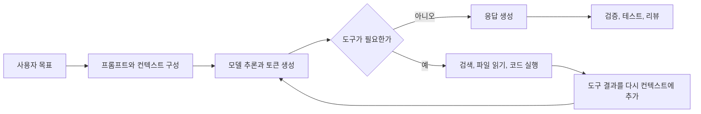

## 들어가기

AI를 쓰면 생산성이 올라간다는 말은 이제 낯설지 않다.

카카오톡 선물하기 이벤트로 ChatGPT Pro 월 구독권 5장을 저렴하게 구매한 뒤, 최근 3개월 동안 월평균 1억 토큰 이상을 사용했다. 그 과정에서 일주일에 하나씩 제품을 만들며 총 3개의 결과물을 만들어봤다. 이 경험으로 한 가지는 분명해졌다. AI를 활용해 실제 결과물을 만들어내는 것은 충분히 가능하다.


이제 질문은 "AI로 만들 수 있는가"가 아니다. **어떻게 더 효율적으로 쓰고, 어디까지 믿고, 무엇으로 검증할 것인가**가 다음 질문이다.

그런데 실제 업무에서는 아직 AI에게 "해줘"라고 말한 뒤 의도, 맥락, 판단 기준은 생략하는 경우가 많다. 모르는 내용을 묻고, 나온 답을 복사하고, 어긋나면 다시 검색하듯 질문을 바꾼다.

이 방식도 도움이 된다. 하지만 AI의 장점은 검색보다 넓다. AI는 주어진 컨텍스트 안에서 다음 작업을 이어가고, 도구를 호출하고, 코드와 문서를 수정하고, 테스트 결과를 다시 읽어 판단을 갱신할 수 있다. 이 차이를 이해하지 못하면 더 좋은 모델을 써도 활용 범위가 좁게 남는다.

이 글은 AI 내부 수학을 자세히 설명하려는 글이 아니다. 개발자가 AI를 업무에 붙일 때 자주 마주치는 개념을 정리한다. 토큰, 비용, 프롬프트, 컨텍스트, 에이전트, 하네스가 실제 작업 품질과 어떻게 연결되는지 보는 것이 목표다.

동시에 이 글은 AI를 더 믿자는 글도 아니다. AI로 결과물을 만들고, 탑다운으로 빠르게 학습할수록 할루시네이션을 더 경계해야 한다. 응답이 그럴듯한지와 사실인지는 다르다. 공식 문서, 테스트, 로그, 원문 링크로 확인하는 일은 여전히 사람의 몫이다.

작성 시점은 2026년 5월 12일이다. 모델 이름, 가격, 한도는 자주 바뀌므로 수치 자체보다 계산 구조와 판단 기준을 중심으로 읽는 편이 안전하다.

---

## AI는 검색 엔진이 아니라 컨텍스트 실행기다

검색 엔진은 문서를 찾아준다. LLM은 주어진 입력과 내부 모델 상태를 바탕으로 다음 토큰을 생성한다. 외부 검색, 파일 읽기, 코드 실행, 브라우저 조작은 모델이 기본으로 아는 능력이 아니라 주변 시스템이 붙여준 도구다.

그래서 AI 활용의 첫 번째 기준은 질문을 잘 쓰는 것이 아니라 **무엇을 컨텍스트로 넣고, 어떤 도구를 허용하고, 결과를 어떻게 검증할지 정하는 것**이다.



이 흐름을 보면 AI 활용은 단일 질문이 아니라 작은 실행 시스템에 가깝다. 한 번의 프롬프트보다 중요한 것은 입력, 도구, 피드백 루프, 검증 기준이다.

---

## 토큰은 AI가 읽고 쓰는 작업 단위다

토큰은 모델이 텍스트를 처리하는 기본 단위다. 단어와 정확히 같지 않다. 문자 하나일 수도 있고, 단어 일부일 수도 있고, 공백이나 문장부호도 토큰 수에 영향을 준다. 영어 기준으로는 대략 1토큰이 4자 또는 0.75단어 정도로 설명되지만, 한국어를 포함한 비영어권 텍스트에서는 비율이 달라질 수 있다.

개발자가 토큰을 알아야 하는 이유는 세 가지다.

1. 토큰 수가 비용에 직접 영향을 준다.
2. 토큰 수가 응답 속도에 영향을 준다.
3. 토큰 수가 컨텍스트 한도 초과 여부를 결정한다.

API 응답의 사용량 필드에는 보통 입력 토큰, 출력 토큰, 전체 토큰이 나온다. 최근 API는 여기에 캐시된 입력 토큰이나 reasoning 토큰처럼 더 세분화된 사용량을 함께 보여주기도 한다.

```text
총 사용량 = 입력 토큰 + 출력 토큰 + 모델별 추가 토큰
실제 비용 = 토큰 종류별 사용량 * 모델별 단가 + 도구 사용 비용
```

여기서 중요한 점은 입력과 출력의 단가가 같지 않을 수 있다는 것이다. 긴 문서를 넣는 비용과 긴 답변을 생성하는 비용은 모델과 제공자에 따라 다르게 책정된다. reasoning 모델에서는 최종 응답에 보이지 않는 추론용 출력 토큰도 사용량에 포함될 수 있다.

ChatGPT, Claude 같은 구독형 제품에서 보이는 "크레딧"이나 "사용량 한도"는 API 토큰 과금과 완전히 같지 않을 수 있다. 제품 UI에서는 메시지 수, 모델, 대화 길이, 파일, 도구 사용량, 서버 부하 같은 요소가 함께 반영될 수 있다. 따라서 비용을 정확히 보려면 해당 제품의 usage 화면이나 API usage 필드를 기준으로 확인해야 한다.

**정리: 토큰은 글자 수가 아니라 모델 작업량에 가깝다. 비용을 줄이려면 짧게 쓰는 것보다 불필요한 입력과 반복 컨텍스트를 줄이는 편이 더 중요하다.**

---

## 프롬프트 엔지니어링은 멋진 문장을 쓰는 일이 아니다

프롬프트 엔지니어링은 모델이 원하는 결과를 안정적으로 만들도록 지시, 예시, 제약, 출력 형식을 설계하는 일이다. "더 친절하게 설명해줘" 같은 표현을 잘 고르는 일이 핵심이 아니다.

실무에서는 아래 네 가지가 먼저다.

| 항목 | 나쁜 요청 | 더 나은 요청 |
|---|---|---|
| 목표 | "이 코드 봐줘" | "동시성 버그 가능성만 리뷰해줘" |
| 기준 | "좋게 고쳐줘" | "동작 변경 없이 중복만 줄여줘" |
| 입력 | "우리 시스템 기준으로" | "아래 ADR과 테스트 규칙을 기준으로" |
| 출력 | "설명해줘" | "위험도 순으로 5개 이하로 정리해줘" |

좋은 프롬프트는 모델에게 모든 것을 맡기지 않는다. 오히려 판단 경계를 명확히 한다.

- 모델이 맡을 역할과 책임 범위를 정한다.
- 모델이 판단할 때 근거로 삼을 자료를 함께 준다.
- 하지 말아야 할 작업과 사람에게 다시 확인해야 할 조건을 적는다.
- 결과 형식, 우선순위, 최대 개수를 정한다.
- 결과를 어떤 테스트나 문서로 검증할지 정한다.

OpenAI와 Anthropic 문서 모두 프롬프트 개선 전에 성공 기준과 평가 방법을 먼저 세우는 접근을 강조한다. 이유는 단순하다. 성공 기준이 없으면 "더 좋아졌다"는 느낌만 남고, 모델이나 프롬프트를 바꿨을 때 품질이 실제로 개선됐는지 확인할 수 없다.

**정리: 프롬프트 엔지니어링은 문장 꾸미기가 아니라 작업 계약을 쓰는 일이다.**

---

## 컨텍스트 엔지니어링은 무엇을 보여줄지 결정하는 일이다

프롬프트 엔지니어링이 "어떻게 지시할지"에 가깝다면, 컨텍스트 엔지니어링은 "무엇을 보여줄지"에 가깝다.

컨텍스트는 모델이 현재 응답을 만들 때 볼 수 있는 정보 묶음이다. 현재 질문, 이전 대화, 시스템 지시, 파일 내용, 검색 결과, 도구 설명, 테스트 출력 등이 모두 컨텍스트가 될 수 있다. 컨텍스트 윈도우는 이 정보를 담을 수 있는 작업 기억 공간이다.

컨텍스트가 크다고 항상 좋은 것은 아니다.

- 오래된 대화가 남아 있으면 현재 목표와 충돌할 수 있다.
- 관련 없는 파일이 많으면 중요한 신호가 묻힌다.
- 긴 로그를 통째로 넣으면 모델이 원인보다 표면 패턴에 끌릴 수 있다.
- 같은 지시를 매번 바꾸면 캐시 효율이 떨어질 수 있다.

그래서 컨텍스트 엔지니어링은 보통 아래 순서로 생각한다.

1. 지금 작업의 성공 기준을 정한다.
2. 성공 기준에 직접 필요한 자료만 고른다.
3. 안정적인 지시와 변하는 입력을 분리한다.
4. 긴 자료는 구조화하거나 요약한 뒤 원문 위치를 남긴다.
5. 모델 답변을 테스트, 로그, 문서로 다시 검증한다.

프롬프트 캐싱도 같은 맥락에서 이해할 수 있다. 제공자별 구현은 다르지만, 공통 아이디어는 반복되는 긴 입력을 매번 새로 처리하지 않도록 재사용하는 것이다. OpenAI는 일정 길이 이상의 동일한 프롬프트 prefix에 자동 캐싱을 적용하고, Anthropic은 `cache_control`로 캐시할 구간을 지정하는 방식을 제공한다. 둘 다 안정적인 지시, 도구 정의, 예시, 긴 배경 자료를 앞쪽에 두고 변하는 사용자 입력을 뒤쪽에 두는 구성이 유리하다.

**정리: 컨텍스트 엔지니어링은 더 많이 붙이는 기술이 아니라, 지금 판단에 필요한 정보만 남기는 기술이다.**

---

## RAG는 모델 기억을 늘리는 기술이 아니다

RAG(Retrieval Augmented Generation)는 외부 문서나 데이터에서 관련 정보를 찾아 현재 프롬프트에 주입하는 방식이다. 모델 자체의 학습 내용을 바꾸는 것이 아니라, 응답 시점에 참고할 근거를 추가한다.

RAG를 쓰면 "모델이 우리 사내 문서를 학습했다"고 표현하기 쉽지만 정확한 표현은 아니다. 더 정확히는 아래에 가깝다.

```text
질문 -> 관련 문서 검색 -> 검색 결과를 컨텍스트에 추가 -> 모델 응답 생성
```

이 차이는 운영에서 중요하다. RAG 품질은 모델 성능만으로 결정되지 않는다. 문서 분할 방식, 임베딩, 검색 쿼리, 랭킹, 중복 제거, 출처 표시, 오래된 문서 정리까지 함께 영향을 준다.

사내 지식 기반을 붙일 때는 아래 질문을 먼저 해야 한다.

- 검색 결과가 실제로 질문에 답할 수 있는가?
- 오래된 문서와 최신 문서를 구분하는가?
- 모델이 근거 문장을 인용하거나 위치를 표시하는가?
- 검색 실패 시 모른다고 말할 수 있는가?
- 답변 품질을 평가할 테스트 질문 세트가 있는가?

**정리: RAG는 모델 기억 확장이 아니라 런타임 근거 주입이다. 검색 품질이 낮으면 좋은 모델도 그럴듯한 오답을 만들 수 있다.**

---

## 에이전트는 자율성이 아니라 피드백 루프의 문제다

에이전트라는 말은 넓게 쓰인다. 어떤 팀은 도구를 쓰는 챗봇을 에이전트라고 부르고, 어떤 팀은 여러 단계의 작업을 스스로 계획하고 실행하는 시스템을 에이전트라고 부른다.

Anthropic은 agentic system을 크게 두 부류로 나눈다.

| 구분 | 설명 | 적합한 상황 |
|---|---|---|
| Workflow | 코드가 미리 정한 경로로 LLM과 도구를 조합한다 | 경로가 명확하고 예측 가능해야 할 때 |
| Agent | LLM이 다음 단계와 도구 사용을 동적으로 결정한다 | 필요한 단계 수를 미리 알기 어려울 때 |

개발 업무에서는 이 구분이 중요하다. 모든 일을 에이전트로 만들 필요는 없다. 브랜치 생성, 린트 실행, 릴리즈 체크리스트처럼 절차가 정해진 일은 workflow가 더 낫다. 반대로 원인 모를 테스트 실패를 조사하거나, 큰 코드베이스에서 수정 범위를 탐색하는 일은 agent 방식이 유리할 수 있다.

에이전트의 핵심은 "알아서 한다"가 아니다. 매 단계마다 환경에서 ground truth를 얻고, 그 결과로 다음 행동을 바꾸는 피드백 루프다.

```text
계획 -> 도구 실행 -> 결과 관찰 -> 계획 수정 -> 다시 실행 -> 검증
```

이 루프에는 비용도 있다. 단계가 늘어나면 토큰과 도구 호출이 늘어난다. 한 번의 잘못된 판단이 다음 단계의 입력으로 들어가면 오류가 누적될 수 있다. 그래서 에이전트에는 중단 조건, 권한 경계, 테스트, 로그, 사람 승인 지점이 필요하다.

**정리: 에이전트는 마법 같은 자율 실행이 아니라 도구 사용과 검증을 반복하는 제어 루프다.**

---

## 하네스 엔지니어링은 AI가 일할 작업장을 만드는 일이다

하네스 엔지니어링은 OpenAI의 Codex 활용 글에서 접한 표현이다. 이 글에서는 AI가 안정적으로 일하도록 감싸는 실행 환경을 설계하는 일로 정리한다.

코딩 에이전트를 예로 들면 하네스는 아래 요소를 포함한다.

- 저장소 구조와 작업 디렉터리
- 읽을 수 있는 문서와 규칙
- 실행 가능한 테스트 명령
- 사용할 수 있는 도구와 권한
- 멈춰야 하는 조건
- 결과 보고 형식
- 실패 로그와 재시도 방식

프롬프트가 작업 지시서라면, 하네스는 작업장이다. 지시서가 좋아도 작업장이 불안정하면 결과가 흔들린다. 테스트가 느리거나, 의존성이 깨져 있거나, 문서가 오래됐거나, 권한 경계가 불명확하면 모델은 그 틈에서 불필요한 추측을 한다.

실무에서 하네스 품질을 높이는 방법은 단순하다.

1. 자주 쓰는 작업은 명령어 하나로 검증되게 만든다.
2. 실패 로그가 원인을 좁힐 수 있게 출력 형식을 정리한다.
3. AI에게 허용할 도구와 금지할 행동을 분리한다.
4. 반복되는 절차는 프롬프트가 아니라 Skill이나 script로 고정한다.
5. 결과는 사람이 검토할 수 있는 diff, 테스트 결과, 링크로 남긴다.

이 관점에서 `AGENTS.md`, ADR, 테스트 스크립트, CI, 린트 규칙은 모두 AI 활용 품질에 영향을 준다. AI를 잘 쓰는 팀은 프롬프트만 잘 쓰는 팀이 아니라 AI가 읽고 실행하고 검증할 수 있는 환경을 잘 정리한 팀이다.

**정리: 하네스 엔지니어링은 AI에게 일을 더 많이 맡기는 기술이 아니라, 맡긴 일을 검증 가능한 형태로 제한하는 기술이다.**

---

## 좋은 AI 활용은 세 가지 질문으로 시작한다

AI를 검색 봇 이상으로 쓰려면 매번 아래 세 가지를 확인해야 한다.

### 1. 이 작업의 성공 기준은 무엇인가

"좋은 답변"은 기준이 아니다. 성공 기준은 관찰 가능해야 한다.

- 테스트가 통과한다.
- 공식 문서 링크가 붙어 있다.
- 기존 API 동작을 바꾸지 않는다.
- 리뷰 코멘트가 파일과 라인 기준으로 정리된다.
- 비용이 이전 방식보다 낮다.

성공 기준이 없으면 프롬프트도, 컨텍스트도, 에이전트도 개선하기 어렵다.

### 2. 모델이 볼 정보와 보지 말아야 할 정보는 무엇인가

모델에게 모든 것을 보여주는 방식은 초반에는 편하지만 규모가 커질수록 비싸고 불안정하다. 현재 판단에 필요한 문서, 코드, 로그만 좁혀야 한다.

반대로 필요한 정보를 숨기면 모델은 추측한다. AI 오답의 상당수는 모델이 멍청해서라기보다, 판단에 필요한 근거가 컨텍스트에 없어서 생긴다.

### 3. 결과를 무엇으로 검증할 것인가

AI가 낸 결과는 최종 결과물이 아니라 검증 대상이다.

- 코드는 테스트와 타입 검사로 검증한다.
- 문서는 공식 문서와 원문 링크로 검증한다.
- 설계는 대안 비교와 실패 조건으로 검증한다.
- 운영 작업은 로그와 롤백 기준으로 검증한다.

이 검증 루프가 있어야 AI 활용이 반복 가능한 엔지니어링이 된다.

---

## 개발자의 일은 사라지기보다 이동한다

AI가 코드를 만들고 문서를 정리하고 테스트까지 제안할 수 있다면 개발자의 직무가 사라질 것처럼 보일 수 있다. 하지만 실제로 결과물을 만들어보면 반대에 가깝다. 생산 속도가 빨라질수록 검증해야 할 양도 함께 늘어난다.

AI가 만든 결과물에는 책임 주체가 없다. 코드가 장애를 만들거나, 문서가 잘못된 사실을 전파하거나, 설계가 장기 변경 비용을 키웠을 때 "AI가 그렇게 했다"는 말은 책임을 대신하지 못한다. 최종적으로 승인하고 배포하고 설명해야 하는 주체는 사람과 조직이다.

그래서 개발자의 역할은 사라진다기보다 이동한다. 직접 타이핑하는 비중은 줄어도, 문제를 정의하고, 맥락을 제공하고, 결과를 읽고, 구조적 결함을 발견하고, 장기 변경 비용을 판단하는 일은 더 중요해진다.

이 지점에서 필요한 역량은 도구 사용법만이 아니다.

- 요구사항의 본질을 좁히는 능력
- 모델이 놓친 전제를 발견하는 능력
- 작동하는 코드와 유지 가능한 코드를 구분하는 능력
- 할루시네이션을 공식 문서와 실행 결과로 검증하는 능력
- "뭔가 이상하다"는 감각을 구체적인 언어로 바꾸는 능력

AI는 보일러플레이트, 반복 구현, 초안 작성 같은 우발적 비용을 크게 줄인다. 하지만 비즈니스 요구사항의 모호함, 설계 목표 사이의 충돌, 미래 변경 방향에 대한 불확실성 같은 본질적 복잡성은 그대로 남는다. 오히려 AI가 결과물을 더 빨리 만들수록 그 본질을 읽고 판단하는 개발자의 역량은 더 선명하게 드러난다.

**정리: AI 시대의 개발자는 덜 중요한 사람이 아니라, 더 많은 결과물에 책임 있는 판단을 내려야 하는 사람이 된다.**

---

## 마무리

AI 활용의 허들은 모델 내부를 모르는 데서만 생기지 않는다. 오히려 더 큰 허들은 AI를 검색창처럼만 바라보는 데서 생긴다.

토큰은 비용과 한도를 결정한다. 프롬프트는 작업 계약을 만든다. 컨텍스트는 모델의 작업 기억을 구성한다. RAG는 외부 근거를 런타임에 주입한다. 에이전트는 도구와 피드백 루프를 반복한다. 하네스는 그 모든 과정이 안전하게 실행되도록 작업장을 만든다.

그래서 AI를 잘 쓰는 개발자의 기준은 "질문을 예쁘게 쓰는 사람"이 아니다. 목표를 정의하고, 필요한 컨텍스트를 고르고, 도구 사용을 제한하고, 결과를 검증 가능한 형태로 회수하는 사람이다.

결과물을 만드는 단계는 이미 가능해졌다. 이제 차이는 더 많이 생성하는 데서만 나지 않는다. 무엇을 만들지, 왜 그렇게 만들지, 어떤 근거로 맞다고 판단할지, 그리고 나중에 어떤 비용으로 돌아올지를 설명할 수 있는지에서 난다.

> AI는 검색 봇보다 작업 시스템에 가깝다.  
> 생산성은 더 긴 프롬프트가 아니라 더 좋은 실행 환경과 검증 기준에서 나온다.

---

## 더 확인할 자료

### 이 글의 팩트체크에 사용한 OpenAI 자료

- 토큰과 비용 구조: [What are tokens and how to count them?](https://help.openai.com/en/articles/4936856-what-are-tokens-and-how-to-count-them)
- 프롬프트와 평가 기준: [Prompt engineering](https://developers.openai.com/api/docs/guides/prompt-engineering), [Working with evals](https://developers.openai.com/api/docs/guides/evals)
- 프롬프트 캐싱: [Prompt caching](https://developers.openai.com/api/docs/guides/prompt-caching)
- API 사용량 필드: [Responses API reference](https://platform.openai.com/docs/api-reference/responses)
- Retrieval/RAG 관점: [Retrieval](https://developers.openai.com/api/docs/guides/retrieval)
- Codex와 하네스 엔지니어링: [하네스 엔지니어링](https://openai.com/ko-KR/index/harness-engineering/)

### 같이 읽어볼 자료

- 프롬프트 패턴을 넓게 훑을 때: [Prompt Engineering Guide 한국어판](https://www.promptingguide.ai/kr)
- agent와 context engineering 관점을 비교할 때: [Anthropic: Building effective agents](https://www.anthropic.com/engineering/building-effective-agents), [Anthropic: Effective context engineering for AI agents](https://www.anthropic.com/engineering/effective-context-engineering-for-ai-agents)
- AI 시대 개발자 역할을 고민할 때: [Evan Moon: AI가 코드를 쓰는 시대, 개발자의 진짜 역량이 드러난다](https://evan-moon.github.io/2026/02/10/developer-in-ai-era/)
